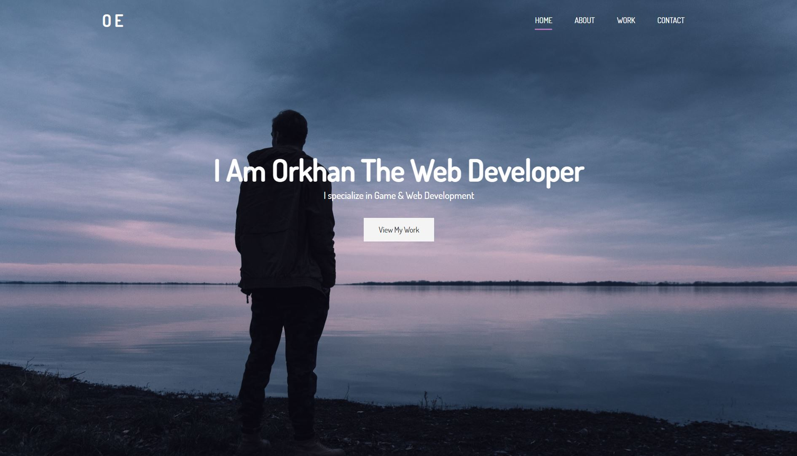
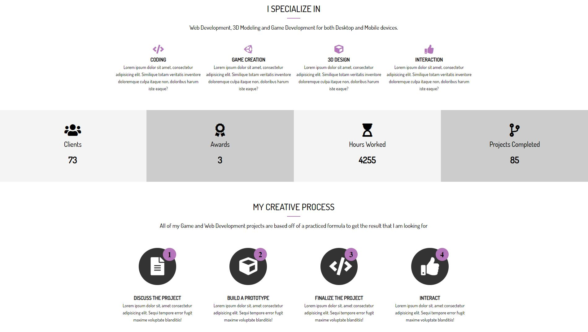
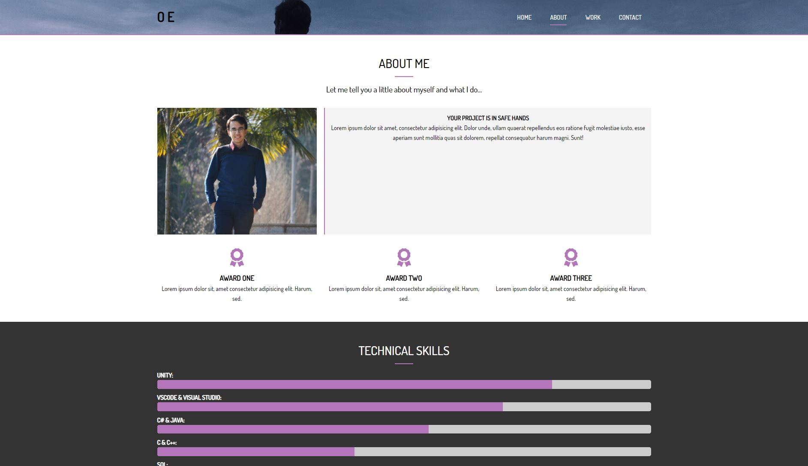
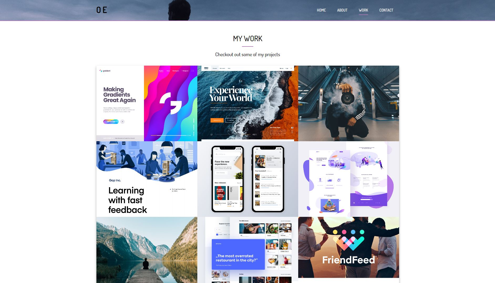

# Portfolio-Website
#### Creating a responsive Portfolio Website using Sass with Home, Projects, About and Contact pages. The website includes smooth transitions, animations and typewriting effect. This website is partially created via [Brad Traversy](https://www.udemy.com/course/modern-html-css-from-the-beginning/)'s Udemy course.

## Screenshots 

### Home page 

### Home page (Specialization, Awards, Workflow sections)

### About page 

### Projects

## Tools used while developing this project
- Visual Studio Code
- Sass
- HTML
- CSS
- JavaScript
- Gitbash

## Acknowledgements
- [fontawesome](https://fontawesome.com/)
- [google fonts](https://fonts.google.com/)

## Contacts 
- E-mail address orkhan.elchuev@gmail.com

